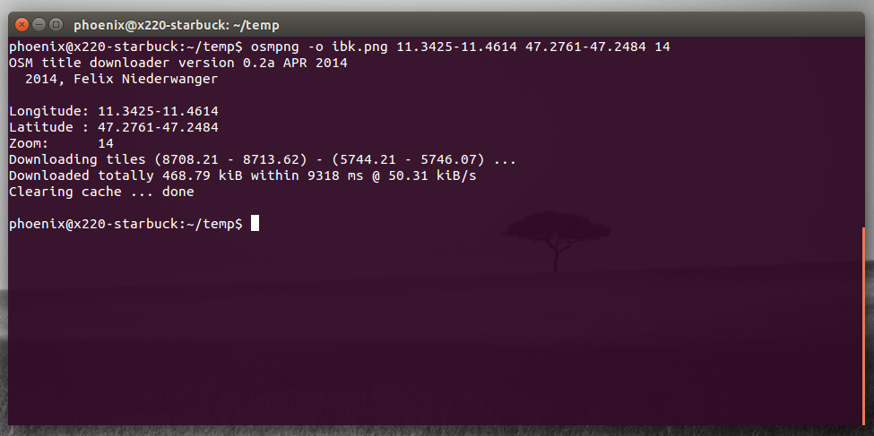

# osmpng

OSM Title downloader and merger tool

## Build

osmpng depends on `libpng++` and `libcurl`. You will need both libraries to complete the compile process.

    make
    sudo make install

## Usage

Type `osmpng --help` for a helpful help message :-)

### Demo 

To download for instance the map of Innsbruck

    osmpng -o ibk.png 11.3425-11.4614 47.2761-47.2484 14

